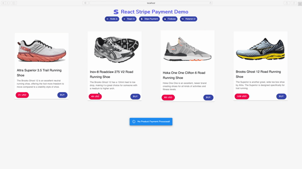

# react-stripe

💳. stripe payment gateway react component. Do give it a try for your projects. For better experience of data flow, i have integrated firebase firestore to perform CRUD on stripe payment transaction.

## How it works !

## Data flow

* Use Proceeds to checkout after product selection (asumption, customer is already in his/her cart page and processing checkout)
* stripe comes into action - takes user information such as email, shipping and billing details and card details
* stipe-api
  * once user presses checkout button, stripe gets use details and performs checkout process at stripe end such as create new user, create charge (everything related to payment i.e. credit card verification, payment processing etc.)
  * Once stripe is is done with its internal processing, it sends response to be received by react front end. This response can be either error (failure of payment, integration set up etc.) or payment data in case of success. Note that react front-end does not store users credit card details.
* upon success response from stripe, react front-end de-structures required input data from stripe response and sends to firebase firestore. Here, you can store bunch of data however, in this project for the sack of demonstration, i have pulled basic user inforamation i.e. name, email, billing address and product details.
* firebase firestore is integrated with react front-end in realtime and transactions are seamless.

Hope i have explained at least basisc of payment processing to some extent. if you have any query, let me know. Happy coding ☺️ ☺️

## Available Scripts

In the project directory, you can run:

### `yarn start` or `npm start`

Runs the app in the development mode.\
Open [http://localhost:3000](http://localhost:3000) to view it in the browser.

